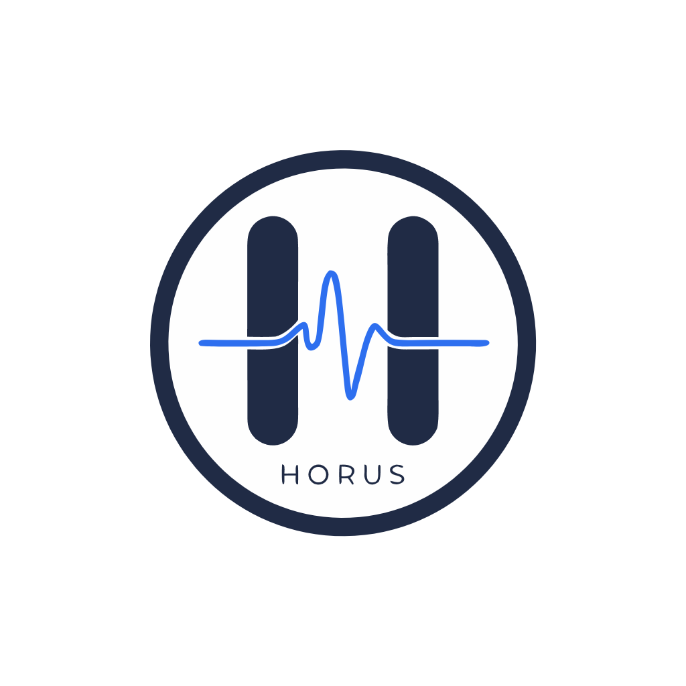

# 🏥 HORUS — Hospital Operations & Zero-Loss Reconciliation Unified System

<div align="center">



**Real-Time Hospital Command Center, Clinical Telemetry & Zero-Loss Census Reconciliation Engine**

[](https://fastapi.tiangolo.com/)
[](https://react.dev/)
[](https://vitejs.dev/)
[](https://www.sqlite.org/)
[](LICENSE)

</div>

---

## 🌟 Executive Overview

**HORUS** is an enterprise-grade hospital operations intelligence platform designed to eliminate operational blindspots, prevent revenue leakage from unrecorded bed occupancy (*Ghost Beds*), streamline diagnostic SLAs, and reconcile physical clinical floor truths with digital electronic health records (EHR/HIS).

Powered by a lightweight, high-throughput **FastAPI backend**, an indexed **SQLite clinical database**, and a high-performance **React 18 frontend**, HORUS connects clinical departments, nursing units, pharmacy inventories, laboratory analyzers, and executive leadership into a unified real-time operations dashboard.

---

## 🚀 Key Modules & Architecture

### 1. 📊 Executive Command Center (`/` or `/dashboard`)
* **6 Executive KPI Metric Tiles**: Live Hospital Occupancy (88.4%), Active Inpatients (2,005), Net Patient Velocity (+5 In/Out), Lab STAT Turnaround (2.1h), Ghost Bed Accuracy (98.2%), and Pharmacy Formulary Safety (400 items).
* **AI Intelligence Center**: Real-time ICU bottleneck risk prediction, data discrepancy flags, and actionable step-down transfer recommendations with 1-click execution.
* **Clinical Department Bed Load Breakdown**: Live capacity gauges across Emergency Trauma, Intensive Care (ICU), General Surgery, Internal Medicine, Cardiology CCU, and Pediatrics.
* **Fast Patient Admission Launcher**: Rapid emergency registration modal with instant ward and bed allocation.

---

### 2. 🛏️ Bed Capacity & Census Truth (`/bed-capacity`)
* **Multi-Date Ward Census Reconciliation**: Compares physical bedside telemetry with digital HIS records across 27 hospital wards over 7 audit dates (189+ census records).
* **Interactive Discrepancy Reconciliation**: Reconcile mismatched HIS counts with manual floor sheets in real-time.
* **CSV Export Utility**: Generates formatted daily census audit reports.
* **Live Patient Discharge Flow**: Real-time stage tracking (Blocked, Clearing, Awaiting) with STAT escalation and physician sign-off triggers.

---

### 3. 👥 Patient Flow & Universal Admissions Ledger (`/patient-flow`)
* **High-Volume Admissions Registry**: Over **4,678 patient admission records** with full clinical details: Patient ID, Assigned Bed, Ward, Department, Diagnosis, Admission Type, and Status.
* **Dynamic Admitted-Only Department Distribution**: Department load bars calculate live occupancy based exclusively on active admitted inpatients.
* **`+ Add New Patient` Modal**: Custom patient admissions with local storage persistence and instant ledger insertion.
* **24-Hour Inflow/Outflow Movement**: Interactive hourly patient admissions and discharges velocity timeline.

---

### 4. 📅 Doctor Appointment Scheduling (`/appointment`)
* **OPD Specialist Matrix**: Doctor profile cards with specialty, qualification, experience, room allocations, and standardized consultation charges.
* **Interactive Shift Manager**: Configure Morning (09:00 AM – 01:00 PM) and Evening (05:00 PM – 09:00 PM) consultation availability per day of the week.
* **Add & Edit Doctor Modal**: Dynamic management of hospital specialist schedules.

---

### 5. 🔬 Diagnostic Turnaround Telemetry (`/diagnostic-turnaround`)
* **Real-time TAT Heatmap**: Average turnaround times across ER, ICU, Oncology, and Cardiology for CBC, MRI, CT, and X-Ray.
* **Live Diagnostics Queue**: Searchable queue tracking test orders (Troponin STAT, CT Chest, Arterial Blood Gas) with SLA countdown targets.
* **`+ Add Diagnostic Test` Modal**: Dispatch new laboratory and imaging orders into the live queue.
* **1-Click Refresh**: Real-time telemetry stream sync with animated status feedback.

---

### 6. 👻 Ghost Bed Auditor (`/ghost-bed-auditor`)
* **Physical vs Digital Census Verification**: 160+ hospital bed telemetry records across 14 active wards.
* **Automatic Discrepancy Classification**:
  * 🔴 **Ghost Bed**: EHR marked *Occupied*, but physical sensor detects *Empty*.
  * 🟡 **Mismatch**: EHR marked *Empty*, but physical weight sensor detects *Occupied*.
  * 🟢 **Matched**: 100% census alignment.
* **Auto-Sync Engine (10s Polling)**: Continuous background RFID telemetry sweep with live heartbeat.
* **1-Click Reconciliation**: Instantly reconcile ghost beds and sync state with hospital EHR.

---

### 7. 💊 Discrepancy Ledger — Pharmacy Formulary (`/discrepancy-ledger`)
* **400 Medicine Formulations**: Inpatient pharmacy stock levels, minimum safety thresholds, unit prices, batch numbers, and expiry risks.
* **Stock Availability Filters**: Real-time filtering by *In Stock*, *Out of Stock* (~30%), and *Expiring Soon*.
* **`+ Add Medicine` Modal**: Register new pharmaceutical drugs and update stock levels dynamically.

---

### 8. 👤 Administrator Profile & Real-Time Sidebar Sync (`/profile`)
* **Role & Department Configuration**: Update administrator name, contact details, and custom avatar.
* **Intelligent Password Management**: First-time password setup does not require current password; subsequent password modifications enforce current password verification.
* **Live Sidebar Sync**: Profile name and avatar changes immediately propagate to the sidebar without page reloads.

---

## 🛠️ Tech Stack & System Architecture

```text
HORUS/
├── backend/
│   ├── app.py                      # Unified FastAPI server & static SPA mount
│   ├── database.py                 # SQLite database engine & dataset ingestion
│   ├── horus.db                    # Indexed SQLite database
│   ├── requirements.txt            # Python dependencies (fastapi, uvicorn, pandas)
│   └── routers/                    # Modular API route controllers
│       ├── dashboard.py            # KPI metrics, Ward Matrix, Discharge Flow
│       ├── ai_insight.py           # AI Risk assessment & clinical step-downs
│       ├── patient_flow.py         # Admissions, discharges, department loads
│       ├── appointments.py         # Doctor scheduling CRUD
│       ├── diagnostics.py          # Lab/Imaging TAT analytics & test queue
│       ├── ghost_beds.py           # Physical vs EHR bed reconciliation
│       ├── pharmacy.py             # Pharmacy formulary & drug inventory
│       └── auth_profile.py         # User profile & settings
│
├── frontend/                       # React 18 + Vite Web Application
│   ├── src/
│   │   ├── components/             # Reusable UI widgets & layout navigation
│   │   │   ├── dashboard/          # KpiRibbon, WardMatrix, AiInsightPanel, DischargeFlow
│   │   │   └── layout/             # Header, Sidebar, Support & Logs Panels
│   │   ├── pages/                  # Full-featured operational views
│   │   │   ├── Dashboard.jsx       # Executive Command Center
│   │   │   ├── BedCapacity.jsx     # Bed Capacity & Census Truth
│   │   │   ├── PatientFlow.jsx     # Patient Flow & Admissions
│   │   │   ├── Appointment.jsx     # Doctor Appointment Scheduling
│   │   │   ├── DiagnosticTurnaround.jsx # Diagnostic Turnaround
│   │   │   ├── GhostBedAuditor.jsx # Ghost Bed Auditor
│   │   │   ├── DiscrepancyLedger.jsx    # Pharmacy Discrepancy Ledger
│   │   │   └── Profile.jsx         # Profile & Security Settings
│   │   ├── services/               # High-volume data services & REST client
│   │   └── styles/                 # Custom component stylesheets
│   ├── package.json
│   └── vite.config.js
│
├── data/                           # 18 Hospital CSV Datasets (45,000+ records)
│   ├── admission.csv
│   ├── bed.csv
│   ├── department.csv
│   ├── diagnostic_test.csv
│   ├── disease.csv
│   ├── doctor.csv
│   ├── drug.csv
│   ├── drug_inventory.csv
│   ├── employee.csv
│   ├── patient.csv
│   └── ward.csv
│
├── run_horus.bat                   # 1-Click Windows batch launcher
├── run_horus.ps1                   # PowerShell automated launcher
└── README.md
```

---

## ⚡ Quick Start & Installation

### Prerequisites
* **Python 3.9+**
* **Node.js 18+** & `npm`

### 1. Clone the Repository
```bash
git clone https://github.com/Alok-Notfound/HORUS---Hospital-management-System.git
cd HORUS---Hospital-management-System
```

### 2. Install Dependencies & Build Frontend
```bash
# Frontend setup
cd frontend
npm install
npm run build
cd ..

# Backend setup
cd backend
pip install -r requirements.txt
```

### 3. Launch HORUS
```bash
# Launch unified production server
python app.py
```
> **HORUS is live at: [http://localhost:5000](http://localhost:5000)**  
> **Interactive API Swagger Docs: [http://localhost:5000/docs](http://localhost:5000/docs)**

---

## 📄 License
This project is open-source and available under the [MIT License](LICENSE).
